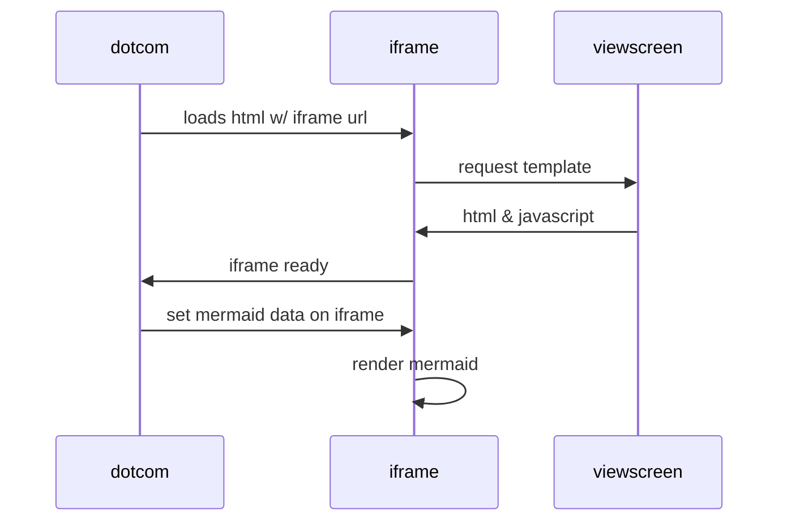

# ASampleClass

This is a class description.

**See** [SomeDto](./SomeDto.md)

**See** [SampleInterface](../Sample-Interfaces/SampleInterface.md)

## Methods
### `public static Map<String,Object> getActiveSurveySettings(String surveyType2)`

Some description

#### Parameters

|Param|Description|
|---|---|
|`surveyType2`|my value|

#### Returns

|Type|Description|
|---|---|
|`Map<String,Object>`|whatever|

### `public static List<String> someMethod()`
### `public static String sampleMethod(List<String> argument)`

Executes commands based on the passed in argument.

### `public static void call()`

Calls the method. This methods allows you to call it.

---
